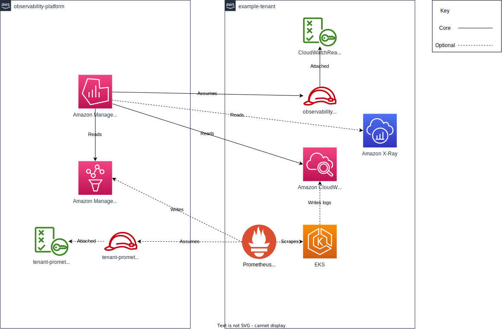

# Architecture

Observability Platform is comprised of Amazon Managed Grafana (AMG) and Amazon Managed Prometheus (AMP).

The current core offering is to provide one central UI (AMG) for visualising multiple AWS account's CloudWatch Logs and Metrics.

Additionally the platform offers a central metric store (AMP), allowing tenants to remote write data for consumption in the same central UI (AMG).

